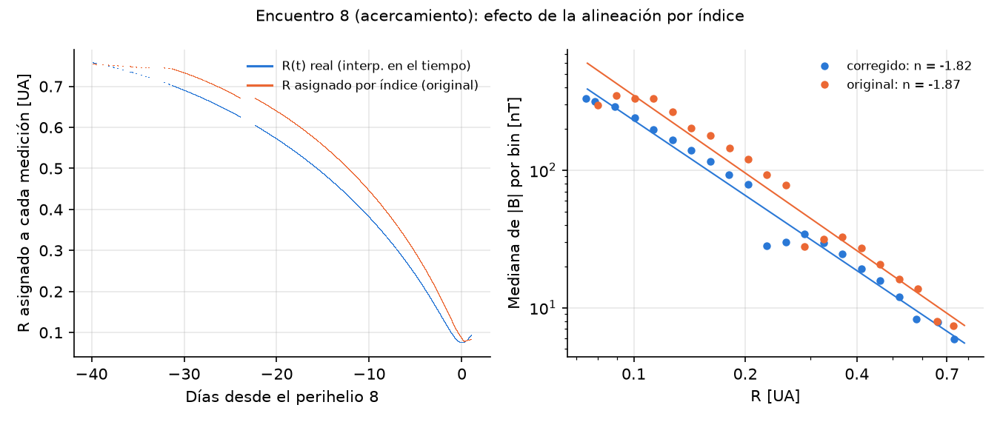
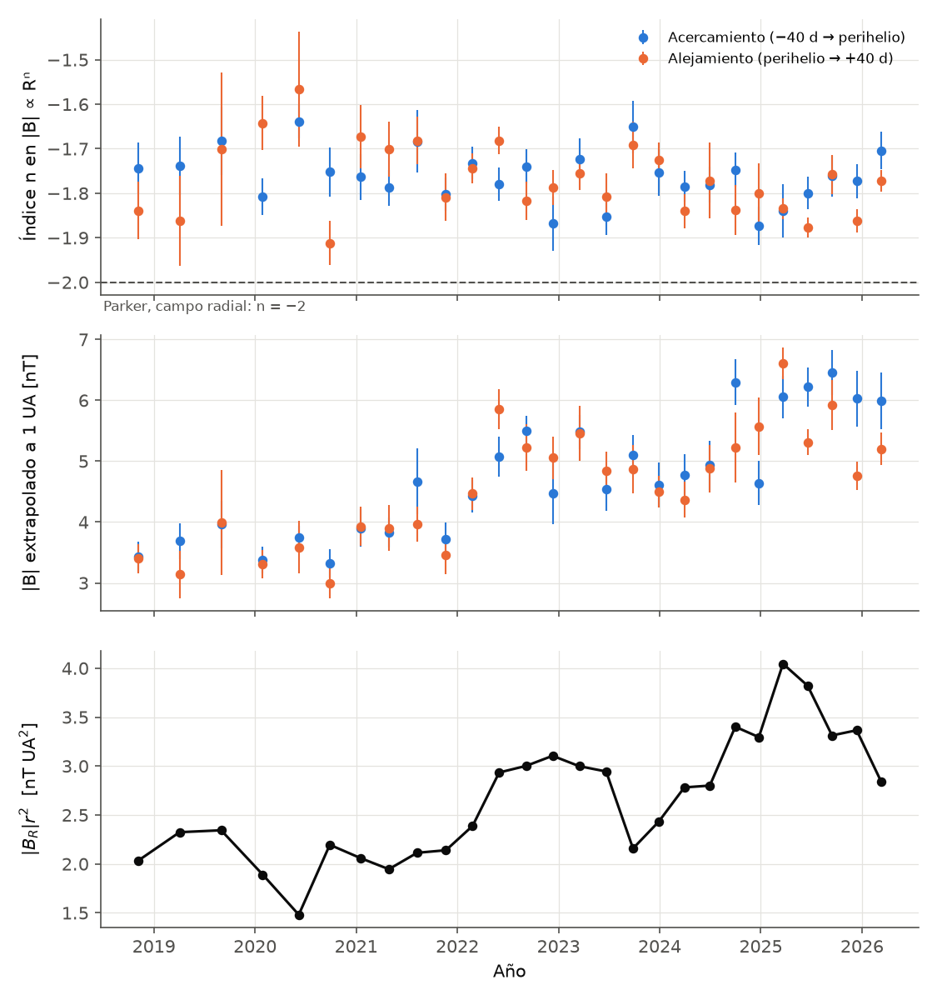
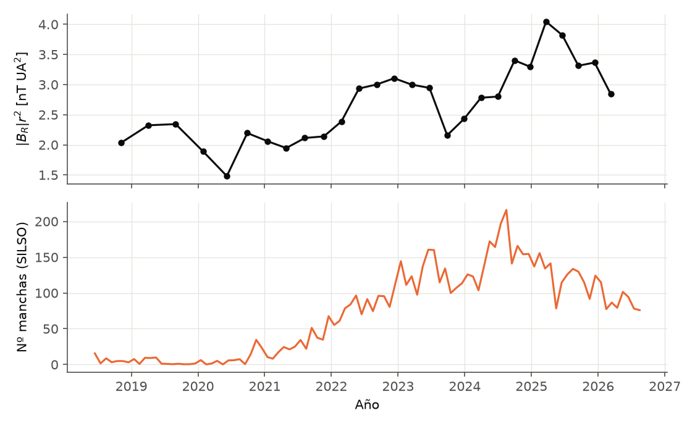

# Revisión del proyecto y propuestas de continuación

*Parker Solar Probe: escalamiento radial del campo magnético. Revisión hecha en septiembre de 2026.*

---

## 0. Resumen

1. **El pipeline funciona, pero el resultado central tiene un sesgo.** En `CargadorDeDatos.igualar_longitud_arrays` la distancia R se alinea con |B| **por índice** y no por tiempo. Cuando hay huecos de datos (lo normal: la cobertura va del 50 al 99 % por tramo), a cada medición se le asigna una R equivocada. En el encuentro 8 el error mediano es de 13 % y el máximo de 50 %, y la pendiente cambia entre 0,1 y 0,3. El valor atípico de la órbita 8 (alejamiento, n ≈ −0,3) **no se reproduce** con la alineación correcta.
2. **Reanálisis corregido con 27 encuentros (2018-2026), usando todo el ciclo 25:**
   - El índice radial es muy estable: **n = −1,77 ± 0,07** (dispersión entre tramos), sin tendencia con el ciclo. Es más plano que lo que predice una espiral de Parker pura en ese rango (−1,88 a −1,96), y eso es una pregunta física abierta y conocida.
   - El intercepto (|B| extrapolado a 1 UA) **sí sigue el ciclo solar**: sube de ≈3,6 nT (E1-E9, mínimo solar) a ≈5-6,5 nT (2024-2025, máximo).
   - El proxy de flujo abierto |B_R| r² sube de ≈2 a ≈4 nT UA². Su correlación con el número de manchas es r = 0,74.
3. **Hay al menos cuatro líneas de replicación publicables** que reutilizan casi todo lo que ya existe: flujo abierto a lo largo del ciclo, perfiles radiales de plasma, anisotropía de temperatura (diagramas "Brazil") y superficie de Alfvén. Se detallan en la §4.
4. **Para una interfaz web publicable** recomiendo un sitio estático en GitHub Pages que consulte la API HAPI de CDAWeb directamente desde el navegador. Verifiqué que CDAWeb responde con `Access-Control-Allow-Origin: *`, así que no hace falta servidor. Si prefieres quedarte en Python, Streamlit.

---

## 1. Qué hace hoy el código

```
DescargadorDeDatos.py ─► raspa el árbol HTML de SPDF y baja todos los .cdf
CargadorDeDatos.py    ─► lee CDF con cdflib → listas de "chunks" (uno por archivo)
CampoMagnetico.py / PendientesInterceptos.py
    ventana [perihelio − 40 d, +1 d] (acercamiento) y [−1 d, +40 d] (alejamiento)
    |B| con quality_flag == 0
    R diaria (helio1day) "estirada" al largo de |B|
    ajuste lineal log|B| vs log R  →  pendiente n, intercepto log B(1 UA)
SeriesTemporales.py, CampoVsLatitudOrbitas.py → gráficos exploratorios
```

La idea física es correcta y está bien planteada: separar acercamiento y alejamiento, seguir la evolución de los coeficientes órbita a órbita e interpretar el intercepto como B a 1 UA. El problema está en la alineación de los datos y en la estadística del ajuste.

---

## 2. Problemas encontrados (ordenados por gravedad)

### 2.1 Crítico: alineación R ↔ B por índice

`CargadorDeDatos.py:171` (`igualar_longitud_arrays`) se usa en `CampoMagnetico.py:89`, `PendientesInterceptos.py:88,148` y `CampoVsLatitudOrbitas.py:88`:

```python
interp_func = interp1d(np.arange(len1), array1)            # R diaria: ~41 puntos
array1_interpolado = interp_func(np.linspace(0, len1 - 1, len2))  # "estirada" a N puntos de B
```

Esto supone implícitamente que las N mediciones de |B| que sobreviven están **uniformemente espaciadas en el tiempo**. Pero antes se eliminaron las mediciones con flag distinto de 0, las de valor de relleno y los huecos de telemetría. Cada hueco desplaza todo lo que viene después hacia una R que no le corresponde.

Lo verifiqué con los datos reales del encuentro 8 (acercamiento, cobertura 80 %):

| | R asignada: error mediano | error máximo | n (OLS, como en el original) |
|---|---|---|---|
| Por índice (original) | 13 % | 33 % (50 % en el alejamiento) | −1,92 (alejamiento: −2,03) |
| Por tiempo (corregido) | — | — | −1,81 (alejamiento: −1,74) |



El sesgo también explica rasgos raros de tus figuras. Los "techos planos" seguidos de caídas cerca del perihelio en los paneles N=4, 8 y 9 de `Acercamiento.png` son mediciones de perihelio asignadas a R más grandes. Si `Totales.png` salió del mismo procedimiento, los "rulos" de ~1000 nT a 0,2-0,3 UA de esa figura, que son físicamente imposibles, tendrían el mismo origen.

**Corrección** (una línea, siempre que filtres el tiempo con la misma máscara que B):

```python
R_en_B = np.interp(t_B, t_efemeride, R_efemeride)   # t en segundos Unix UTC
```

### 2.2 Errores de los coeficientes mal etiquetados y sin sentido estadístico

- `np.polyfit(x, y, 1)` devuelve `[pendiente, intercepto]`, así que `V[0,0]` es la varianza de la **pendiente**. En `PendientesInterceptos.py:102-103` las etiquetas están invertidas. En `CampoMagnetico.py:103-104` también.
- En `PendientesInterceptos.py:161-162` (alejamientos) se usa `V`, la matriz del *último acercamiento*, en lugar de `Vmatrix`. Las barras de error de los alejamientos no corresponden a su propio ajuste.
- `cov='unscaled'` supone σ = 1 dex por punto, lo que no tiene sentido. Y aunque se escale, con ~50 000 puntos **fuertemente autocorrelacionados** (switchbacks, estructuras de horas) el error formal (~0,003) subestima la incertidumbre real en un orden de magnitud. En el reanálisis usé **bootstrap por bloques diarios**, que da errores de ≈0,03-0,1, del orden de la dispersión real entre órbitas.

### 2.3 Sesgo de muestreo en el ajuste

Por la segunda ley de Kepler, la sonda pasa mucho más tiempo lejos del Sol. En un ajuste OLS sobre todos los puntos de 1 minuto domina el tramo 0,4-0,75 UA. Además, las fluctuaciones de |B| no son gaussianas en log (hay switchbacks, cruces de la lámina de corriente y CMEs). Hay dos alternativas razonables: ajustar las **medianas de log|B| en bins logarítmicos de R** (lo que hice), o ponderar cada punto por 1/(densidad de muestreo en log R).

### 2.4 Problemas menores

- `CargadorDeDatos.py:96`: `len(indices_chunk) > 0` siempre es verdadero, porque `np.where` devuelve una tupla. No rompe nada, pero el filtro no filtra.
- `R = data_filtrada_R[0]` supone que la ventana cae en un único archivo de efemérides. Además, **el directorio `ephemeris/helio1day/` de SPDF hoy está vacío**: fue reemplazado por `helio1hr/`, que es un único archivo para toda la misión. El código ya no es reproducible tal cual.
- `datetime.fromisoformat('2018-11-05').timestamp()` usa la zona horaria local (Chile, UTC−3/−4), mientras que `cdflib.cdfepoch.unixtime` está en UTC. Da un desfase de 3-4 h. Además, el perihelio 1 real fue el 2018-11-06 a las 03 UT. Conviene calcular los perihelios como mínimos de R. Abajo están los 30 perihelios hasta diciembre de 2026.
- En el descargador hay un `with open(...)` duplicado (líneas 65 y 71). No valida el tamaño del archivo bajado, y ante un corte reinicia recursivamente todo el directorio.
- Hay cuatro scripts con el mismo encabezado copiado (lista de perihelios, carga y bucles de filtrado). Los bucles en Python puro sobre millones de puntos se reemplazan por `np.linalg.norm(B, axis=1)` y máscaras booleanas.
- **El historial de git pesa ~160 MB** porque en algún momento se versionaron `Codigo Nuevo/FIELDS/data_*.cdf`, que ya fueron borrados pero siguen en el historial. Si quieres un repo liviano, `git filter-repo --path "Codigo Nuevo/FIELDS" --invert-paths`. Eso reescribe el historial, así que hay que coordinarlo con quien más tenga clones. No lo hice.

---

## 3. Reanálisis corregido: 27 encuentros, 2018-2026

Está en `Codigo Propuesto/analisis_encuentros.py`. Baja los datos por HAPI con caché local, alinea por tiempo, detecta los perihelios, ajusta sobre medianas en bins de log R con bootstrap diario y calcula |B_R| r² para r < 0,25 UA. Los resultados numéricos quedan en `Codigo Propuesto/resultados_por_encuentro.csv`.



**Lectura física**

- **Pendiente.** Promedio ponderado n = −1,78, con dispersión entre tramos de 0,07 y χ²_red ≈ 2,3: hay algo de variabilidad real entre órbitas más allá del error de bootstrap. La correlación con el número de encuentro es débil (−0,31). Una espiral de Parker ideal, |B| = B_R(r)·√(1 + (Ωr/V)²) con B_R ∝ r⁻², ajustada en 0,06-0,75 UA da n = −1,88 (V = 300 km/s) a −1,96 (600 km/s). **Lo observado es más plano**, lo cual es consistente con:
  - Helios en viento rápido: B_R ∝ r^−1,81 y B_T ∝ r^−1,21 (Perrone et al. 2019).
  - PSP + Solar Orbiter, que dan B_R ∝ r^−1,66 cuando se incluyen distancias mayores.
  - Una contribución de las fluctuaciones a |B|, que en WKB escalan como δB ∝ r^−1,5.

  Separar esas contribuciones (componente media contra fluctuaciones, y viento rápido contra lento) es un problema bien definido.
- **Intercepto.** B(1 UA) pasa de ≈3,6 nT (E1-E9) a ≈5,1 nT en promedio desde E10, con picos de 6-6,5 nT en 2024-2025. Es el ciclo solar 25 visto desde dentro de 0,25 UA.
- **Flujo abierto.** |B_R| r² ≈ 2,0-2,3 nT UA² en el mínimo, compatible con el 2,5 (+0,3/−0,6) nT UA² de Badman et al. (2021). Luego sube a ≈4 nT UA² a comienzos de 2025. Su correlación con el número de manchas mensual es r = 0,74. La caída puntual de E17 (sept. 2023) merece una mirada caso a caso: puede deberse a un muestreo dominado por una sola corriente o a la latitud.



**Advertencias de este reanálisis rápido.** Los datos de 1 min vía HAPI no traen los quality flags. Para algo publicable hay que leer el CDF, que sí los trae, o usar pyspedas. No separé ICMEs, cruces de la lámina de corriente ni tipos de viento. Tampoco corregí la aberración ni el efecto de la latitud heliográfica.

<details><summary>Perihelios detectados (mínimos de RAD_AU en PSP_HELIO1HR_POSITION)</summary>

| E | Fecha (UT) | R [R☉] | | E | Fecha (UT) | R [R☉] |
|---|---|---|---|---|---|---|
| 1 | 2018-11-06 03h | 35,7 | | 16 | 2023-06-22 04h | 13,3 |
| 2 | 2019-04-04 22h | 35,7 | | 17 | 2023-09-27 23h | 11,4 |
| 3 | 2019-09-01 18h | 35,7 | | 18 | 2023-12-29 00h | 11,4 |
| 4 | 2020-01-29 09h | 27,9 | | 19 | 2024-03-30 02h | 11,4 |
| 5 | 2020-06-07 08h | 27,9 | | 20 | 2024-06-30 03h | 11,4 |
| 6 | 2020-09-27 09h | 20,3 | | 21 | 2024-09-30 05h | 11,4 |
| 7 | 2021-01-17 17h | 20,3 | | 22 | 2024-12-24 11h | 9,87 |
| 8 | 2021-04-29 09h | 16,0 | | 23 | 2025-03-22 22h | 9,87 |
| 9 | 2021-08-09 19h | 16,0 | | 24 | 2025-06-19 09h | 9,87 |
| 10 | 2021-11-21 08h | 13,3 | | 25 | 2025-09-15 20h | 9,87 |
| 11 | 2022-02-25 15h | 13,3 | | 26 | 2025-12-13 07h | 9,87 |
| 12 | 2022-06-01 23h | 13,3 | | 27 | 2026-03-11 18h | 9,85 |
| 13 | 2022-09-06 06h | 13,3 | | 28 | 2026-06-08 04h | 9,85 |
| 14 | 2022-12-11 13h | 13,3 | | 29 | 2026-09-04 15h | 9,85 |
| 15 | 2023-03-17 20h | 13,3 | | 30 | 2026-12-02 01h | 9,85 (predicción) |

`mag_RTN_1min` está disponible en CDAWeb hasta el 2026-04-30, así que hoy se pueden analizar completos hasta E27.
</details>

---

## 4. Hacia dónde llevar la investigación

Las líneas están ordenadas de menor a mayor esfuerzo. Todas reutilizan la infraestructura del proyecto: descarga, alineación temporal, ajustes y figuras por encuentro.

### A. Flujo magnético abierto a lo largo del ciclo 25 (continuación natural)

- **Qué replicar.** Badman et al. 2021 (A&A 650, A18) midieron el flujo abierto hasta 0,13 UA con E1-E5. Mostraron que acercarse al Sol reduce la sobreestimación que producen las inversiones locales del campo (switchbacks) y que el valor sigue siendo demasiado alto para los modelos PFSS. Es el llamado *open flux problem* (Linker et al. 2017).
- **Qué extender.** Hoy hay 27 encuentros que cubren el mínimo, el ascenso y el máximo. Tu figura de intercepto ya muestra la tendencia. El paso siguiente es:
  1. Replicar los métodos de Badman (media, moda y |B_R| r² filtrando por ángulo de pitch o por la dirección del strahl de electrones).
  2. Comparar con OMNI a 1 UA. Tu descargador ya apuntaba a `omni_cdaweb/hourly`.
  3. Comparar con modelos PFSS construidos con `sunkit-magex`, el sucesor de pfsspy, y magnetogramas GONG.
- **Por qué es atractivo.** La física es limpia, el costo computacional es bajo y se cruza con un problema abierto reconocido. Antes de escribir, conviene revisar en ADS si alguien ya publicó la serie completa del ciclo 25 con PSP. Es plausible que esté en preparación.

### B. Perfiles radiales de plasma (n, V, T, B) en r < 0,3 UA

- **Qué replicar.** Liu, Jia & Liu 2024 (ApJL 963, L36) y Yogesh et al. 2026 (ApJ, E1-E24, "Solar Wind Heating Near the Sun: A Radial Evolution Approach"). Como referencia a mayores distancias: Perrone et al. 2019 (Helios, viento rápido puro).
- **Datos.**
  - Momentos de protones SPAN-i: `PSP_SWP_SPI_SF00_L3_MOM`.
  - Densidad electrónica por ruido cuasi-térmico (QTN), más confiable que SPAN-i para la densidad: `PSP_FLD_L3_SQTN_RFS_V1V2`.
  - Campo: el que ya usas.
- **Extensión.** Separar por velocidad o por alfvenicidad (σ_c) y estimar el índice politrópico T ∝ n^(γ−1) (Nicolaou et al. 2020, ApJ 901, 26).

### C. Anisotropía de temperatura y diagramas "Brazil" (retomar el código antiguo)

`Codigo Antiguo/colorbar.py` ya hacía histogramas de β∥ contra T⊥/T∥ normalizados por columna. Esa línea tiene mucha tradición en Chile, y hay trabajo muy reciente con PSP de grupos chilenos:

- **Coello-Guzmán, Pinto, Navarro & Moya (2026)**, *The Effect of Expansion and Instabilities in the Thermodynamic Regulation of the Young Solar Wind Plasma* (arXiv:2603.25443). Muestran que β∥ determina qué inestabilidad limita la anisotropía a 10-30 R☉ y encuentran T⊥/T∥ ∼ β∥^−0,55.
- **Huang et al. 2020** (ApJS 246, 70): la anisotropía de protones con el primer encuentro de PSP. Observaron calentamiento perpendicular más fuerte que el de Helios.
- **Revisión de referencia:** Yoon, P. H. (2017), *Kinetic instabilities in the solar wind driven by temperature anisotropies*, Rev. Mod. Plasma Phys.

**Replicación concreta.** Construir el diagrama Brazil de PSP por bins de distancia, superponer los umbrales de inestabilidad (mirror, firehose paralela y oblicua, ion-cyclotron; con los ajustes de Hellinger et al. 2006) y ver cómo la distribución migra con R. Nota técnica: el tensor de temperatura de SPAN-i viene en coordenadas de instrumento y hay que proyectarlo sobre **b̂**. Esa es la parte delicada.

### D. Superficie de Alfvén y viento sub-alfvénico

- **Tu encuentro 8 contiene el primer cruce de la superficie de Alfvén**: el 28 de abril de 2021, a las 09:33 UT, durante ~5 h con M_A ≈ 0,79 (Kasper et al. 2021, PRL 127, 255101).
- **Replicación.** Calcular M_A = V_R / V_A, con V_A = B/√(μ₀ n m_p), en todos los encuentros y catalogar los intervalos con M_A < 1.
- **Contraste reciente.** Badman et al. 2025 (ApJL, arXiv:2509.17149) reconstruyen la geometría de la superficie de Alfvén con varias naves durante el ciclo 25 y encuentran que su altura varía hasta 30 % con la actividad. Con E22-E27 a 9,86 R☉ hay mucho más tiempo sub-alfvénico disponible que en 2021.

### E. Switchbacks

- **Tasas de ocurrencia contra distancia.** Pecora et al. 2022 (ApJL 929, L10) encuentran que la tasa cae bruscamente al acercarse a ~0,2 UA. Hay una revisión reciente sobre alfvenicidad, tasa y tamaño: arXiv:2607.10516 (2026).
- **Detección automática.** ParkerNet (ApJS 2025) es una CNN + LSTM con catálogos de referencia (Huang et al. 2023; Pecora et al. 2022). Su código es abierto: `DonaK695/PSP_ParkerNet_switchback_classifier`.
- **Escala de parches.** La modulación en escalas de supergranulación y granulación (Fargette et al. 2021, ApJ 919, 96; Bale et al. 2021).
- Requiere datos de mayor resolución (`mag_RTN_4_Sa_per_Cyc`). Es buena puerta de entrada al aprendizaje automático si te interesa.

### F. Turbulencia

- Chen et al. 2020 (ApJS 246, 53): el espectro magnético pasa de −3/2 cerca de 0,17 UA a −5/3 hacia 0,6 UA. El de velocidad se mantiene cerca de −3/2.
- Replicarlo es un ejercicio espectral clásico: Welch o wavelets en ventanas de 6-12 h e índice ajustado en 0,02-0,1 Hz. Se puede extender a E22-E27 (a 9,86 R☉) y al rango 1/f (Huang et al. 2023, ApJL).

### G. Alineaciones PSP-Solar Orbiter (mismo plasma a dos distancias)

- Telloni et al. 2021 (ApJL) estudiaron la primera alineación radial, **también en abril de 2021 (E8)**. Luego vino la identificación de una misma parcela de plasma (A&A 2024).
- Dakeyo et al. 2026 (arXiv:2605.01511) proponen alinear por **fuente**, usando la cercanía de las huellas fotosféricas por *backmapping*. Con 548 pares encuentran que el viento sigue acelerando ~45 % por década radial.
- Es el camino más sólido para separar la evolución radial de la variabilidad temporal y de fuente, que es la gran limitación de tu ajuste por órbita.

### Proyecto concreto que recomendaría para empezar

> **"Escalamiento radial de |B| y flujo magnético abierto a lo largo del ciclo solar 25 con 27 encuentros de PSP".**
> 1. Consolidar el pipeline corregido con quality flags, separación de ICMEs (catálogo de Möstl et al., HELIO4CAST) y separación por tipo de viento.
> 2. Separar B_R y B_T y ajustarlos por separado. La pregunta es de dónde sale n ≈ −1,77: de la espiral, de las fluctuaciones o de la latitud.
> 3. Replicar Badman 2021 en E1-E5 como validación y luego extender a E6-E27. Comparar con OMNI y con PFSS.
> 4. Figura final: flujo abierto contra el número de manchas y contra la fase del ciclo.
>
> Después de eso, C o D son el paso natural hacia la física de plasmas (C encaja con grupos locales).

---

## 5. Interfaz de visualización publicable

### Opción 1 (recomendada): sitio estático en GitHub Pages + HAPI desde el navegador

- **Datos en vivo sin servidor.** `https://cdaweb.gsfc.nasa.gov/hapi/data?id=PSP_FLD_L2_MAG_RTN_1MIN&parameters=...&time.min=...&time.max=...&format=csv` responde con CORS abierto (lo verifiqué). Un `fetch()` desde JavaScript basta. Documentación: [hapi-server.org](https://hapi-server.org/).
- **Gráficos.** Plotly.js, o uPlot si quieres series de millones de puntos con buen rendimiento.
- **Productos precalculados.** Tablas de ajustes por encuentro, perihelios y flujo abierto se generan con el script de Python en una **GitHub Action** programada (por ejemplo, semanal) y se publican como JSON o CSV en el mismo sitio.
- **Vistas sugeridas:**
  1. Órbita en el plano eclíptico (HGI) con selector de encuentro y la posición de la sonda animada en el tiempo.
  2. Serie temporal de B_R, B_T, B_N y |B| con R en un eje secundario compartido en x (no en y).
  3. Dispersión de |B| contra R para el encuentro elegido, con el ajuste y la recta de Parker.
  4. La figura de coeficientes contra el ciclo solar.
  5. Una "tarjeta" del último perihelio con su distancia, velocidad y |B| máximo.

### Opción 2: Streamlit (todo en Python)

- Reutiliza el código directamente. Se despliega gratis en Streamlit Community Cloud o en Hugging Face Spaces.
- Con **stlite** (Streamlit sobre Pyodide/WebAssembly) puede incluso correr como página estática en GitHub Pages.
- Hay un modelo a imitar: **Solar-MACH** (Gieseler et al. 2023, Front. Astron. Space Sci.), una app Streamlit de conectividad magnética de naves muy usada por la comunidad.

### Opción 3: Panel/HoloViz + Datashader

Para explorar interactivamente millones de puntos, por ejemplo datos de alta resolución de switchbacks. Es más pesado de desplegar.

**Mi recomendación.** Empezar con la opción 2 si el objetivo es iterar rápido sobre la ciencia, y migrar a la opción 1 cuando las vistas estén estables. La arquitectura clave es la misma en ambos casos: **un paquete `psp_tools/` (descarga, alineación, ajustes) que usan tanto los notebooks como la app**.

---

## 6. Mejoras de ingeniería

1. **Acceso a datos.** Reemplazar el raspado HTML por HAPI (`hapiclient`), por **PySPEDAS** (`pyspedas.psp.fields(trange=..., datatype='mag_RTN_1min')`) o por `speasy`. Todos cachean y manejan versiones de archivos.
2. **Estructura.** Un paquete con `pyproject.toml`: `psp_tools/datos.py`, `alineacion.py`, `ajustes.py`, `graficos.py`. Los notebooks o scripts de análisis quedan en `analisis/`. Así se elimina el código duplicado entre los cuatro scripts.
3. **Formato intermedio.** Guardar series ya alineadas en **Parquet** (pandas) o NetCDF (xarray), una por encuentro. Cargar 80 días de 1 min es instantáneo.
4. **Pruebas mínimas.** Un test que construya un R(t) sintético con huecos y verifique que la alineación sea correcta. Es exactamente el bug que había.
5. **Reproducibilidad.** Congelar versiones en `requirements.txt` o `environment.yml`, registrar la versión de cada CDF (v01, v02…) y no versionar datos (ya agregué `.gitignore`).

---

## 7. Plan sugerido

| Semana | Tarea |
|---|---|
| 1 | Pasar el código a paquete; validar el reanálisis con quality flags (CDF o pyspedas) |
| 2-3 | Separar B_R y B_T; ajustar por tipo de viento; quitar ICMEs |
| 3-4 | Replicar Badman 2021 (E1-E5); extender a E6-E27; comparar con OMNI |
| 4-5 | Primera versión de la app (Streamlit) con las vistas 1-4 |
| 6+ | Elegir C (anisotropía) o D (superficie de Alfvén) como segundo eje |

---

## Referencias

**Escalamiento radial y flujo abierto**
- Badman, S. T. et al. (2021). *Measurement of the open magnetic flux in the inner heliosphere down to 0.13 AU*. A&A 650, A18. [arXiv:2009.06844](https://arxiv.org/abs/2009.06844)
- Liu, W., Jia, H., Liu, S. (2024). *Radial Evolution of the Near-Sun Solar Wind: Parker Solar Probe Observations*. ApJL 963, L36. [doi](https://iopscience.iop.org/article/10.3847/2041-8213/ad2a4a)
- Yogesh et al. (2026). *Solar Wind Heating Near the Sun: A Radial Evolution Approach*. ApJ. [arXiv:2602.10275](https://arxiv.org/abs/2602.10275)
- Perrone, D. et al. (2019). *Radial evolution of the solar wind in pure high-speed streams: HELIOS revised observations*. MNRAS. [arXiv:1810.04014](https://arxiv.org/abs/1810.04014)
- Evolución del flujo abierto a lo largo de varios ciclos (Solar Physics, 2026). [link](https://link.springer.com/article/10.1007/s11207-026-02664-8)

**Superficie de Alfvén**
- Kasper, J. C. et al. (2021). *Parker Solar Probe Enters the Magnetically Dominated Solar Corona*. PRL 127, 255101. [doi](https://link.aps.org/doi/10.1103/PhysRevLett.127.255101)
- Badman, S. T. et al. (2025). *Multi-spacecraft Measurements of the Evolving Geometry of the Solar Alfvén Surface Over Half a Solar Cycle*. ApJL. [arXiv:2509.17149](https://arxiv.org/abs/2509.17149)

**Anisotropía e inestabilidades**
- Coello-Guzmán, M., Pinto, V. A., Navarro, R. E., Moya, P. S. (2026). *The Effect of Expansion and Instabilities in the Thermodynamic Regulation of the Young Solar Wind Plasma*. [arXiv:2603.25443](https://arxiv.org/abs/2603.25443)
- Huang, J. et al. (2020). *Proton Temperature Anisotropy Variations in Inner Heliosphere Estimated with the First PSP Observations*. ApJS 246, 70. [arXiv:1912.03871](https://arxiv.org/abs/1912.03871)
- Yoon, P. H. (2017). *Kinetic instabilities in the solar wind driven by temperature anisotropies*. Rev. Mod. Plasma Phys. [link](https://link.springer.com/article/10.1007/s41614-017-0006-1)

**Switchbacks y turbulencia**
- Pecora, F. et al. (2022). *Magnetic Switchback Occurrence Rates in the Inner Heliosphere*. ApJL 929, L10. [arXiv:2202.04216](https://arxiv.org/abs/2202.04216)
- *Radial Evolution of Near-Sun Magnetic Switchbacks: Alfvénicity, Occurrence Rate, and Size* (2026). [arXiv:2607.10516](https://arxiv.org/abs/2607.10516)
- *An Iterative, Deep Learning Approach for Switchback Classification in PSP Data* (ParkerNet, ApJS 2025). [doi](https://iopscience.iop.org/article/10.3847/1538-4365/adf2a2) · [código](https://github.com/DonaK695/PSP_ParkerNet_switchback_classifier)
- Fargette, N. et al. (2021). *Characteristic Scales of Magnetic Switchback Patches Near the Sun...* ApJ 919, 96. [doi](https://iopscience.iop.org/article/10.3847/1538-4357/ac1112)
- Chen, C. H. K. et al. (2020). *The Evolution and Role of Solar Wind Turbulence in the Inner Heliosphere*. ApJS 246, 53.

**Alineaciones PSP-Solar Orbiter**
- Telloni, D. et al. (2021). *Evolution of Solar Wind Turbulence from 0.1 to 1 au during the First PSP-Solar Orbiter Radial Alignment*. ApJL.
- *Identification of a single plasma parcel during a radial alignment of PSP and Solar Orbiter* (2024). A&A. [arXiv:2402.12382](https://arxiv.org/abs/2402.12382)
- Dakeyo, J.-B. et al. (2026). *On the Radial Evolution of the Solar Wind: The Source Alignment Method...* [arXiv:2605.01511](https://arxiv.org/abs/2605.01511)

**Revisiones y estado de la misión**
- Raouafi, N. E. et al. (2023). *Parker Solar Probe: Four Years of Discoveries at Solar Cycle Minimum*. Space Sci. Rev. 219, 8. [doi](https://doi.org/10.1007/s11214-023-00952-4)
- NASA (junio de 2026). *Parker Solar Probe Makes 28th Close Pass of Sun* (la misión extendida después de 2026 está en revisión). [link](https://science.nasa.gov/blogs/parker-solar-probe/2026/06/11/parker-solar-probe-makes-28th-close-pass-of-sun/)

**Herramientas**
- PySPEDAS, módulo PSP. [docs](https://pyspedas.readthedocs.io/en/latest/psp.html)
- HAPI (Heliophysics API). [hapi-server.org](https://hapi-server.org/)
- Gieseler, J. et al. (2023). *Solar-MACH*. Front. Astron. Space Sci. [arXiv:2210.00819](https://arxiv.org/abs/2210.00819) · [app](https://solar-mach.github.io)
- stlite (Streamlit en el navegador). [github](https://github.com/whitphx/stlite)
- SILSO, número de manchas mensual. [sidc.be/SILSO](https://www.sidc.be/SILSO/)
